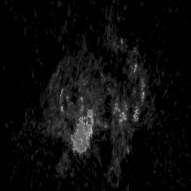
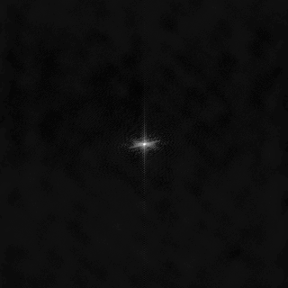

# Learning Neural Implicit Representations of MRI Data

<table align="center"><tr>
<td> 
   
</td>
<td>  
   
</td>
</tr></table>

# Introduction

This is the repository for the project "Learning Neural Implicit Representations of MRI Data" of the ADLM Praktikum, supervised by Wenqi Huang and Robert Graf. Within this repository, our objective is to delve into and compare the most recent advancements in Implicit Neural Representations (INRs) for accurately modeling MRI data. The primary goal is to assess and compare the effectiveness of various methods for processing MRI data, both in image space and k-space. Our particular focus is on multi-coil data. 

# Data

We use [FastMRI's multi coil dataset](https://fastmri.org/) for our experiments. For ease of use with local config files, download the data and symlink it to ./data in the project's root directory.

# Requirements

```
    conde create --name inr
    conda activate inr
    pip install -r requirements.txt
```

# Running code

To run an experiment create a [configuration file as in here](src/config/local). Some basic configuration files already exist and the basic usage is

```
python src/train.py --config path/to/config
```

To run the experiments with multiple samples use the data samples config files:

```
python src/train.py --config path/to/config --data_samples path/to/data_samples
```

# Running Multi-Scale Training

To train a multiscale network on k-space data, run the following command:

```
python src/train_kspace_multiscale.py --config path/to/config
```

Our Multi-Scale Network is based on a light-weight pre-processing step that clusters the available k-space data. Note that the clustering setup must be included in the config as in [this file](./src/config/local/config_fourier_multiscale.yaml).

To run the experiments with multiple samples use the data samples config files:

```
python src/train_kspace_multiscale.py --config path/to/config --data_samples path/to/data_samples
```

Note that the clustering setup must be included in the config as in [this file](./src/config/local/config_fourier_multiscale.yaml)

# Config Parameters

The configuration file is the main entry point to modify the behavior of the INR during training.

## Model Choices:

* Single-Scale: `["SIREN", "WIRE", "WIRE2D", "FFN", "FOURIER", "GABOR"]`

* Multi-Scale: `["Fourier", "BoundedFourier"]`

In particular, FourierNet and GaborNet are presented in [3]. We base our Multi-scale networks off of [4].

## Loss Choices: 

Available Criteria: `["L2", "MSLE", "FFL", "L1", "HDR", "tanh"]`

In Particular, HDR loss is presented in [1] and Tanh loss in [2]. LSL is a lightweight HDR loss.

Generally, HDR is superior in recovering the K-space periphery if set up correctly. Otherwise, L2 and Tanh are good choices.

## Normalization

Available Normalizations: `["abs_max", "max" "max_std", "coil"]`

Generally, per-coil normalization `"coil"` and normalizing by the absolute max `"max"` are good choices.

## Clustering

Here we provide an example on how to set up the ring clustering
```
    partition:
      no_steps: 40 # Initial number of rings
      no_models: 4 # Final number of rings after clustering

```

## Undersampling

Here we provide an example on how to set up the undersampling param
```
# Supported formats:
#   grid-x*y          example: grid-3*3
#   random_line-p     example: random_line-0.5 
#   radial-acc_fac    example: radial-4
#   none              No undersamping
undersampling: grid-2*1

```
Note: In order to use line sampling, we have not implemented seperate implementation but it uses our grid sampling code so
For Column sampling use grid-n*1  where n is the accelartion in column axis
For Row sampling use grid-1*n     where n is the accelartion in row axis

## Special Batching For Undersampling:

To set the dataloader to load batches per coil, please set the parameter `per_coil: True` in the config file.

If per coil batching is used, one can also set `use_tv` to calculate the total variation loss on the coil to enforce spatial smoothness as in [5].

## Hyperparameter Search

To perform a hyperparameter search, one can use two methods - **Grid Search** and **Random Search**. To use a method use a sample for model WIRE as below:

```json
{
  "method": "random",
  "num_search": 2,
  "search_space": {
    "batch_size":{
      "values": [10000, 25000],
      "type": "int"
    },
    "lr": {
      "values": [0.00001, 0.00003],
      "type": "log"
    },
    "net.network_depth": {
      "values": [2, 4],
      "type": "int"
    },
    "net.scale": {
      "values": [10, 20],
      "type": "int"
    },
    "normalization": {
      "values": ["coil", "gaussian_blur", "max_std", "max"],
      "type": "item"
    }
  }
}

```

The hyperparameters must be added in the key `search_space` and each hyperparameter must have a type belonging to `['log', 'int', 'float', 'item']`.
A nested hyperparameter like `scale` should be appended after a '.' with it's parent key, like `net.scale`.

To perform the search use the following command: 
```
python src/hp_search_script.py --config path/to/config --hp_config path/to/hp_config
```

# References 

[1] Huang, W., Li, H., Cruz, G., Pan, J., Rueckert, D., & Hammernik, K. (2022). Neural Implicit k-Space for Binning-free Non-Cartesian Cardiac MR Imaging. Information Processing in Medical Imaging.

[2] Chen, X., Liu, Y., Zhang, Z., Qiao, Y., & Dong, C. (2021). HDRUNet: Single Image HDR Reconstruction with Denoising and Dequantization. 2021 IEEE/CVF Conference on Computer Vision and Pattern Recognition Workshops (CVPRW), 354-363.

[3] Fathony, R., Sahu, A., Willmott, D., & Kolter, J.Z. (2021). Multiplicative Filter Networks. International Conference on Learning Representations.

[4] Lindell, D.B., Veen, D.V., Park, J.J., & Wetzstein, G. (2021). Bacon: Band-limited Coordinate Networks for Multiscale Scene Representation. 2022 IEEE/CVF Conference on Computer Vision and Pattern Recognition (CVPR), 16231-16241.

[5] Block, K. T., Uecker, M., & Frahm, J. (2007). Undersampled radial MRI with multiple coils. Iterative image reconstruction using a total variation constraint. Magnetic resonance in medicine, 57(6), 1086–1098. https://doi.org/10.1002/mrm.21236